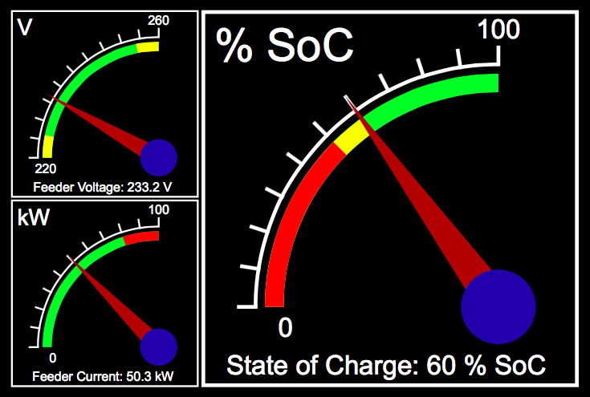

SVG Gauge
==================

[![license][license-img]][github] [![github][github-img]][github]

Simple gauges using SVG

Core functionality includes:

* Value display
* Low/high & low-low/high-high alarm indicators
* Label display

Example:

[license-img]: http://img.shields.io/badge/license-LGPL-a0a060.svg?style=flat-square
[github-img]: https://img.shields.io/badge/github-dslik%2Fsvg--gauge-a0a060.svg?style=flat-square